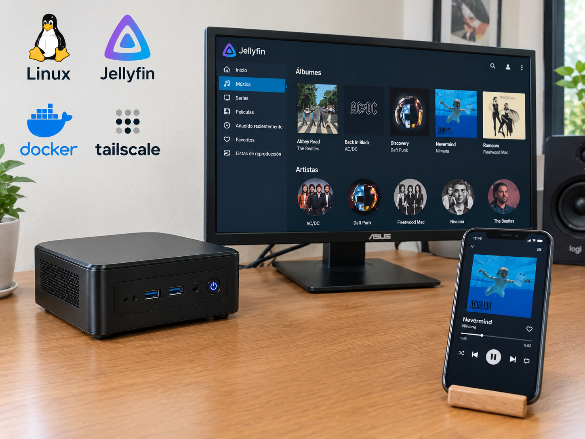

# Wilmer's Personal Site

Hi! I built this personal website to share my work, projects, and ideas in one place. I wanted a simple portfolio where I could present what I’m creating and keep my work organized in a clean, easy-to-navigate format.

This website is a lightweight portfolio built with HTML, CSS, and JavaScript. It gives me a space to showcase my projects, explain what I’m working on, and share my contact information with visitors.

## Installation

To run this website locally, clone the repository, open the project folder, and start a local web server:

```bash
git clone https://github.com/your-username/your-portfolio.git
cd your-portfolio
python -m http.server 8000
```

Then open http://localhost:8000 in your browser.

## Features

- Clean and minimal portfolio layout.
- Project cards with individual detail pages.
- Responsive design for different screen sizes.
- Contact section with GitHub and email links.
- Simple structure that is easy to update and maintain.

## Technologies

This website uses **HTML** for structure, **CSS** for design and layout, and **JavaScript** for interactivity. The project is intentionally simple and lightweight so it remains easy to customize and expand over time.

## Project Image



---

This project is part of my personal portfolio and reflects my interest in self-hosting, home infrastructure, and media systems.
